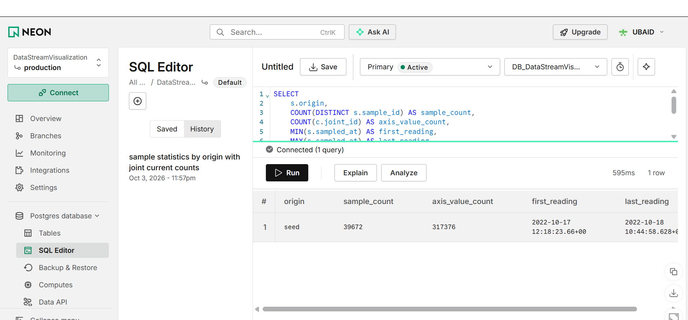
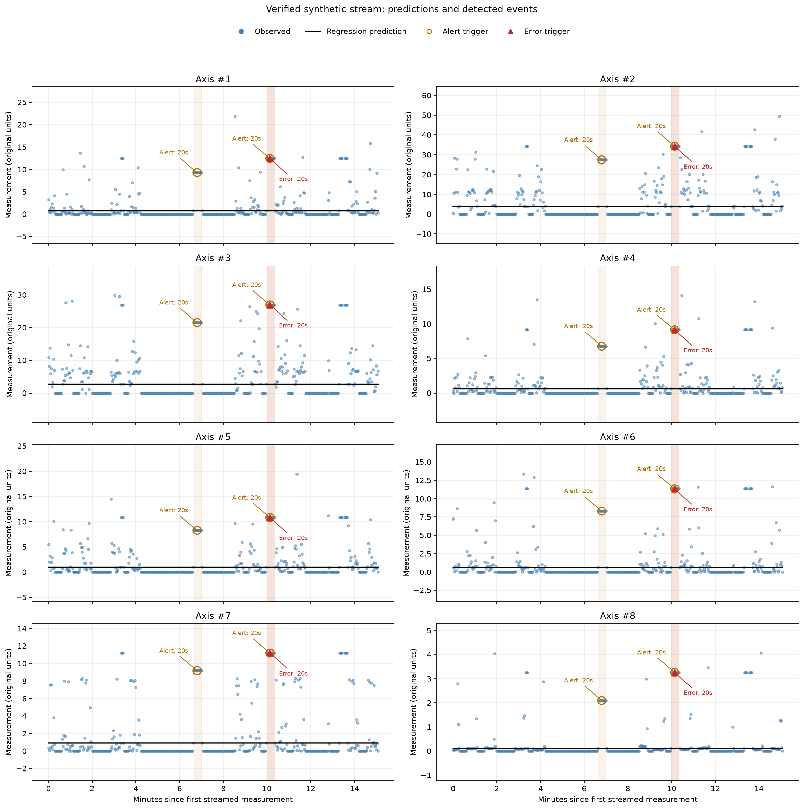
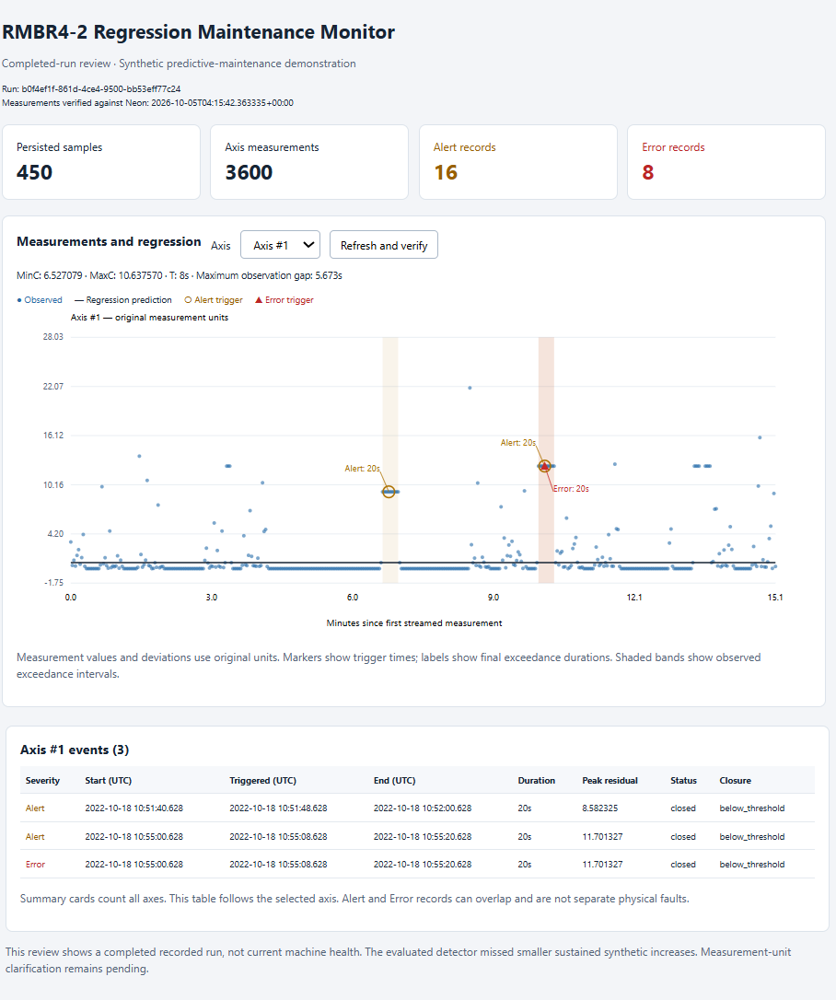

# Streaming Predictive Maintenance with Linear Regression-Based Alerts

**CSCN8010 · Practical Lab 1**  
An extension of the Data Stream Visualization Workshop.

This project trains eight univariate linear regression models on historical robot joint measurements retrieved from Neon PostgreSQL. It generates synthetic testing data, replays a CSV into the cloud database, queries each persisted reading, and detects sustained positive deviations from the regression predictions. A web dashboard combines regression plots, event annotations, thresholds, and event records for a completed streaming run.

**Repository:** [DataStreamVisualization-regression-based-anomaly-detection](https://github.com/UbaidUllah777/DataStreamVisualization-regression-based-anomaly-detection)

## Team — Group 2

| Member | Student ID |
| --- | --- |
| Ubaid Ullah | 9110715 |

## Verified results

| Component | Recorded result |
| --- | --- |
| Historical data in Neon | 39,672 readings and 317,376 axis measurements |
| Historical CSV/database comparison | Matching row counts, timestamps, and values; maximum absolute measurement difference: 0.0 |
| Regression models | Eight models: elapsed time → Axis #1–#8 |
| Detector unit tests | Eight tests passed |
| Controlled development scenarios | All 32 cases passed |
| Final synthetic baseline | 39,672 readings; zero threshold events with frozen settings |
| Streaming demonstration | 450 readings and 3,600 axis measurements persisted in Neon |
| Streaming event log | 16 Alert records and 8 Error records |
| Dashboard | Database verification, axis selection, event table, and refresh checked successfully |

These results demonstrate the implemented pipeline and its behavior on synthetic scenarios. They do not establish accuracy on real equipment failures.

## Project organization

| Location | Purpose |
| --- | --- |
| `Regression_Anomaly_Detection.ipynb` | Main lab notebook: analysis, threshold discovery, evaluation, streaming, and visualization |
| `analysis/` | Reusable Python classes for preprocessing, scaling, regression, residual analysis, synthetic generation, detection, evaluation, and plotting |
| `acquisition/` | CSV reading, synthetic CSV export, and the predictive streaming pipeline |
| `persistence/` | Neon database access, historical loading, stream-run tracking, and CSV event logging |
| `monitor_web/` | Flask dashboard and its templates |
| `tests/` | Detector tests covering timing, thresholds, continuity, and event lifecycle |
| `data/RMBR4-2_export_test.csv` | Historical training data supplied for the course |
| `data/synthetic/` | Generated baseline/scenario exports, scaled representations, labels, and streaming CSV |
| `results/development/` | Development event records |
| `results/stream_runs/<run_id>/` | Per-run predictions, events, and frozen configuration |
| `docs/images/` | Database evidence, regression/event plots, and dashboard screenshot |
| `requirements.txt` | Pinned packages from the tested environment |

The notebook calls reusable classes in the Python modules. The previous workshop notebook and supporting files are retained as background; use `Regression_Anomaly_Detection.ipynb` for this lab.

## Data and preprocessing

The historical dataset contains 39,672 readings between **2022-10-17 12:18:23.660 UTC** and **2022-10-18 10:44:58.628 UTC**. Axes #1–#8 are represented internally as `j1`–`j8`. The remaining axis columns in the original CSV layout are empty and are excluded from modeling.

The historical CSV is loaded into Neon. Training data are then queried from the database into the application before fitting the models and preprocessing parameters.

- The eight modeled axes contain no missing or infinite values in the inspected data.
- Elapsed seconds are measured from the first historical timestamp. Testing data use the same reference timestamp.
- Original measurements are preserved for regression and threshold comparisons.
- Min–Max normalization and Z-score standardization are separate representations, both fitted only on historical training data. Synthetic data reuse those parameters without refitting.
- Inverse transformations were checked against the original values. Synthetic Min–Max values may exceed 1 when measurements exceed the training maximum; they are not clipped.
- `IDLE` and `RUNNING` are derived labels: all eight axes equal to zero indicates `IDLE`. They are not independently recorded machine-health labels.

**Measurement units:** The assignment describes deviations in kWh, while the dataset describes current and the inherited database uses an `amps` field. These are different physical quantities. This implementation retains the supplied measurement scale and labels results as **original measurement units**. No unsupported conversion to kWh is performed.

## Regression and residual analysis

For each axis, the model is:

```text
predicted_measurement = slope × elapsed_seconds + intercept
residual = observed_measurement − predicted_measurement
```

The notebook records the slope, intercept, training R², MAE, and RMSE for all eight models. It includes scatter plots with regression lines, residual distributions, residuals over time, operating-state comparisons, and upper-tail outlier counts.

Training R² values are close to zero: elapsed time alone explains very little of the variation in these measurements. Approximately 64.24% of historical readings have all axes at zero, and operating activity strongly affects the residuals. The required time-only regression therefore serves as a simple baseline, with this limitation explicitly considered when interpreting alerts.

## Threshold discovery and selected rules

Thresholds were derived from historical residuals and compared using development experiments. The analysis examined the 95th, 97.5th, and 99th percentiles, exceedance durations, and alternative continuity limits.

The selected per-axis rules are:

```text
MinC = historical residual 97.5th percentile
MaxC = max(historical residual 99th percentile,
           MinC + historical residual standard deviation)
T = 8 seconds
Maximum permitted gap between consecutive readings = 5.673 seconds
```

| Axis | MinC | MaxC | T (seconds) | Maximum gap (seconds) |
| --- | ---: | ---: | ---: | ---: |
| #1 | 6.527079 | 10.637570 | 8 | 5.673 |
| #2 | 19.594129 | 27.827261 | 8 | 5.673 |
| #3 | 15.652730 | 22.004903 | 8 | 5.673 |
| #4 | 4.540263 | 7.724843 | 8 | 5.673 |
| #5 | 5.660199 | 8.931155 | 8 | 5.673 |
| #6 | 5.621047 | 9.737241 | 8 | 5.673 |
| #7 | 7.205220 | 9.371965 | 8 | 5.673 |
| #8 | 1.114214 | 2.866628 | 8 | 5.673 |

Values above are rounded for display. The pipeline uses the calculated configuration values.

### Evidence supporting the choices

- **MinC:** Axis #8's 95th-percentile threshold produced 27 historical runs lasting at least 12 seconds under the provisional continuity setting. The 97.5th percentile reduces sensitivity to frequent historical excursions.
- **T:** At the 97.5th percentile and a 5.673-second gap limit, the longest historical exceedance lasted 5.592 seconds. An 8-second persistence requirement suppresses these brief excursions while detecting the tested sustained increases.
- **MaxC:** Axis #7's original 97.5th- and 99th-percentile thresholds differed by only 0.021979. The standard-deviation separation rule increased its MaxC to 9.371965. In development experiments, this preserved Alerts for sustained 4σ increases while reserving Errors for larger tested increases. Other axes' MaxC values were unchanged.
- **Continuity:** The median historical interval is 1.891 seconds; the selected gap limit is three times this value. Sensitivity analysis also examined two and four times the median. The selected setting breaks continuity at 701 historical intervals. A more permissive 7.564-second limit produced an Axis #7 exceedance of 9.536 seconds at the 97.5th percentile, showing that event counts depend on the continuity assumption.

The separation rule and gap tolerance are documented engineering choices, not manufacturer fault limits. Zero events on a baseline does not by itself prove that the thresholds are optimal or that all baseline observations are healthy.

### Event semantics

- **Alert:** residual ≥ MinC continuously for at least T seconds.
- **Error:** residual ≥ MaxC continuously for at least T seconds.
- Each axis and severity has its own timer. A reading below its threshold resets that timer.
- A gap greater than 5.673 seconds breaks continuity. A gap equal to the limit is permitted.
- Durations use reading timestamps, from the first qualifying reading to the last qualifying reading, rather than row counts or processing time.
- Continuity is inferred from consecutive qualifying observations within the permitted gap; the signal between observations is not directly measured.
- A sustained Error-level excursion also satisfies the Alert rule, so both records are retained. Thus, 24 threshold records do not mean 24 distinct physical incidents.
- `triggered_at` records when the duration requirement is first met. Ending the stream does not establish recovery.

## Synthetic data and evaluation

Synthetic baselines are generated reproducibly from historical training data using block resampling and small multiplicative noise. This preserves joint relationships and short sequences within sampled blocks while retaining zero measurements. Means, standard deviations, zero percentages, and training-fitted scaling transformations are compared with the historical data.

Development and final evaluation are separated. Settings were frozen before the final baseline was generated with **seed 2026**.

### Controlled detector scenarios

Four scenarios are constructed for each of the eight axes:

| Scenario | Purpose |
| --- | --- |
| Brief high deviation | Verify that a 4-second excursion does not satisfy the 8-second duration rule |
| Sustained moderate deviation | Verify Alert detection for a 20-second excursion between MinC and MaxC |
| Sustained high deviation | Verify both rules for a 20-second excursion above MaxC |
| Gap-interrupted high deviation | Verify that an 8-second recording gap splits the excursion into segments too short to trigger |

All 32 development cases passed. These threshold-relative scenarios check implementation behavior; they are not independent evidence of fault-detection accuracy.

### Final additive-increase experiments

The frozen settings were evaluated in 288 experiments across eight axes, three locations, four increase sizes, and three durations. Increases were based on historical axis standard deviations rather than chosen directly from the thresholds.

| Injected increase | Duration | Cases | Alert detections | Error detections |
| --- | --- | ---: | ---: | ---: |
| 1σ or 2σ | 12 or 30 seconds | 96 | 0 | 0 |
| 4σ | 12 seconds | 24 | 24 | 1 |
| 4σ | 30 seconds | 24 | 24 | 1 |
| 8σ | 12 seconds | 24 | 24 | 24 |
| 8σ | 30 seconds | 24 | 24 | 24 |
| All tested increase sizes | 4 seconds | 96 | 0 | 0 |

The median first-detection delay among detected cases was 8 seconds. The final synthetic baseline produced zero threshold events. Baseline means differed from historical means by approximately +0.95% to +6.91%; standard deviations differed by approximately −2.04% to +5.03%.

The detector identified large sustained increases in these experiments but missed the tested 1σ and 2σ increases, even when sustained. This limits its usefulness for detecting subtle early degradation. Synthetic evaluation cannot establish real-world failure prediction performance.

## Cloud streaming and persisted outputs

The demonstration follows this sequence:

1. Read the synthetic CSV using the timed streaming simulator.
2. Persist each reading and its eight axis measurements in Neon.
3. Query the persisted reading back into the application.
4. Apply the training time reference and training-fitted scaling parameters.
5. Predict in original units, calculate residuals, and update the stateful detector.
6. Save structured event and prediction outputs for the run.

The verified demonstration used `data/synthetic/stream_demo_seed2026_short.csv` and persisted **450 readings / 3,600 axis measurements**. Its recorded wall-clock runtime was **945.5 seconds**, including database operations. Historical training records remained intact.

Each run has a unique ID. Its output directory contains:

- `events.csv`: run ID, event ID, axis, severity, threshold, start, trigger time, end, duration, peak residual, status, and closure reason.
- `predictions.csv`: database sample references, timestamps, observations, scaled representations, predictions, residuals, and detector status.
- `configuration.csv`: the eight axes' selected MinC, MaxC, duration, and gap settings.

Telemetry and run membership are persisted in Neon; threshold event records are persisted in CSV. The dashboard verifies saved predictions against the database readings for the selected run.

## Installation and execution

### 1. Clone the repository and create an environment

The tested environment is **Windows, Git Bash, and Python 3.13.7**. The pinned requirements were exported from that environment and include Windows-specific packages. Installation on other operating systems may require platform-specific adjustments.

```bash
git clone https://github.com/UbaidUllah777/DataStreamVisualization-regression-based-anomaly-detection.git
cd DataStreamVisualization-regression-based-anomaly-detection
python --version
python -m venv .venv
source .venv/Scripts/activate
python -m pip install -r requirements.txt
python -m pip check
```

Use Python 3.13.7 to reproduce the tested environment. The recorded dependency check reported `No broken requirements found`; this check concerns installed dependency compatibility rather than model correctness.

### 2. Configure Neon PostgreSQL

**For the instructor:** A password-protected ZIP containing the configured `.env` file will be provided separately by email. The archive password will be included in the email body.

Extract the archive using the supplied password, then place the extracted `.env` file in the project root, beside `README.md` and `Regression_Anomaly_Detection.ipynb`. Ensure its filename remains `.env`, not `.env.txt`.

This configuration connects the application to the Neon database used for this submission, including the persisted historical data and streaming demonstration records.

**For other users:** Create a `.env` file in the project root containing your own Neon connection string:

```dotenv
DATABASE_URL=postgresql://<user>:<password>@<host>/<database>?sslmode=require
```

Replace the placeholders with your Neon credentials. The database role must be able to create the required schema and tables and read/write project data.

The `.env` file contains database credentials. Keep both the file and its ZIP archive out of Git and the public repository.

### 3. Populate and verify historical data

Run these commands before running the lab notebook against a new database:

```bash
python -m persistence.bootstrap_db seed
python -m persistence.bootstrap_db check
```

The verified result has 39,672 CSV rows, 39,672 historical database rows, a maximum absolute measurement difference of 0.0, and `MATCH`.

### 4. Execute the lab notebook

```bash
jupyter lab
```

Open **`Regression_Anomaly_Detection.ipynb`**, select the project `.venv` kernel, and execute the cells in order from the project root. Keep the outputs saved in the notebook for review.

The notebook performs the analysis, generates synthetic data, evaluates the frozen detector, creates a streaming run, persists its readings, and produces the run artifacts. Allow at least approximately 16 minutes for the demonstrated streaming section, plus time for the remaining analysis; database latency affects runtime.

Record the generated `stream_run_id`. The dashboard requires both that run's database records and its local CSV artifacts. A fresh database must have its own run generated; copying result files alone does not populate Neon.

### 5. Run detector tests

```bash
python -m unittest tests.test_streaming_detector -v
```

The eight tests cover inclusive thresholds and duration boundaries, timer resets, independent severity timing, gaps, duplicate/out-of-order timestamps, and stream-end handling.

### 6. Open the dashboard

In a second terminal with the same environment active, use the ID produced by your notebook:

```bash
python -m monitor_web.dashboard_server --run-id YOUR_RUN_ID
```

For the recorded demonstration, the command was:

```bash
python -m monitor_web.dashboard_server --run-id b0f4ef1f-861d-4ce4-9500-bb53eff77c24
```

Open [http://127.0.0.1:8061](http://127.0.0.1:8061). Stop the server with `Ctrl+C`.

The dashboard operates in **Completed-run review** mode. It provides run totals, an axis selector, observed measurements and regression predictions, Alert/Error markers with durations, selected thresholds, an event table, and **Refresh and verify**. It is not a continuously updating live-monitoring interface.

For the recorded run, Axis #7 displays MaxC **9.371965** and three threshold records. Run-level totals are 16 Alerts and 8 Errors.

## Results and screenshots

### Historical records persisted in Neon



The historical database contains 39,672 readings and 317,376 axis measurements. CSV/database verification also checks their timestamps and measurement values.

### Regression predictions and detected events



The streaming plots combine observations, regression predictions, event markers, and duration annotations.

### Integrated review dashboard



The integrated dashboard combines the plots and structured event information in a single interface. Axis switching, the Axis #7 configuration and event count, and database refresh were checked during the recorded run.

## Limitations and interpretation

- Time-only regression does not model robot load, operation cycles, or other drivers of current; its near-zero training R² is reported rather than interpreted as a strong fit.
- Historical observations have no confirmed failure labels. Statistical outliers are not automatically equipment faults.
- Synthetic tests assess behavior under designed deviations. They do not establish real-world precision, recall, or remaining useful life.
- The selected continuity policy resets across some historical sampling intervals; a different gap tolerance can change event counts.
- Regression beyond the training period is extrapolation. Longer deployments would require drift monitoring and model review.
- The standard-deviation severity margin provides separation for this lab, not a certified equipment safety threshold.
- Small sustained increases were missed in the final experiments. Future work could evaluate operating-state baselines and richer features while retaining an independently evaluated test set.


## Insights and Conclusion

### Key insights

- **Elapsed time alone is a weak predictor of joint measurements.** The eight regression models produced training R² values close to zero. Differences between idle and running periods help explain why a single time-based regression cannot capture the robot’s operating behavior.

- **Thresholds need to reflect each axis’s behavior.** Residual magnitudes differed substantially across axes, supporting separate MinC and MaxC values. Axis #7 required an additional severity margin because its original percentile-based Alert and Error thresholds were almost identical.

- **Duration and recording gaps affect detection.** The 8-second persistence requirement filtered out the tested 4-second excursions. Resetting timers across excessive recording gaps prevented missing observations from being counted as evidence of continuous deviation.

- **The final detector responded to large sustained increases.** All tested 4σ increases lasting 12 or 30 seconds triggered Alerts, and all tested 8σ increases at those durations triggered both rules. The median first-detection delay among detected cases was 8 seconds.

- **Sensitivity to subtle changes remains limited.** The tested sustained 1σ and 2σ increases were not detected. Although the final synthetic baseline produced zero events, this does not establish a zero false-alarm rate on real operating data.

### Conclusion

This lab extended the earlier streaming workshop into a database-backed regression and anomaly-detection pipeline. Historical measurements persisted in Neon PostgreSQL were used to train eight models and derive thresholds. Synthetic readings were then streamed into the database, queried for prediction, evaluated using continuous-duration rules, and presented through an integrated dashboard with structured event logs.

The verified streaming demonstration persisted 450 readings and produced 16 Alert records and 8 Error records. These are threshold records rather than 24 separate incidents, because a sustained Error-level excursion also satisfies the Alert rule.

The project demonstrates reproducible threshold discovery, stateful streaming detection, and traceable results. Its predictive-maintenance value is the ability to flag sustained unusual measurements for investigation; it does not establish that an equipment failure is imminent. Future improvements should evaluate operating-state baselines, additional explanatory features, and real labeled fault data to improve sensitivity and assess practical detection performance.


## Lab deliverables and provenance

The main notebook documents the modeling and threshold-discovery process. The Python modules implement the reusable OOP pipeline; `data/` contains training and synthetic CSVs; `results/` contains structured outputs; and `docs/images/` contains visual evidence. The submission PDF supplies the team names, student IDs, and repository URL separately.

The historical dataset was supplied as course material. This project extends the earlier [Data Stream Visualization Workshop](https://github.com/shainaulakh/DataStreamVisualization). Synthetic datasets and experiment outputs are generated by this project's code. The inclusion of course material does not establish a separate redistribution license.
